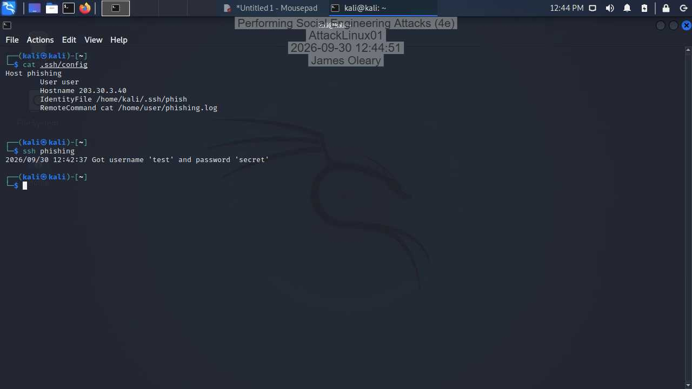
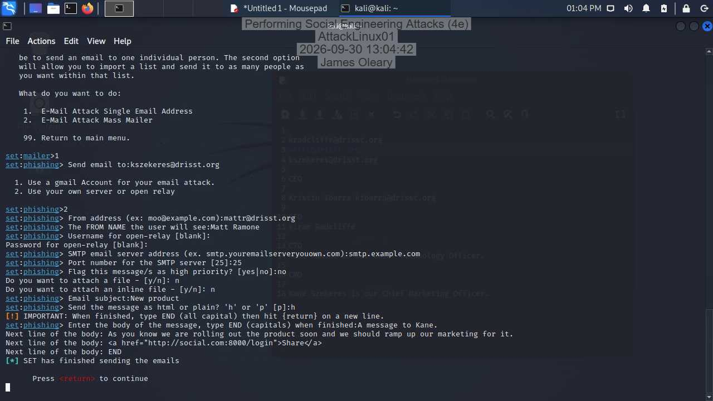
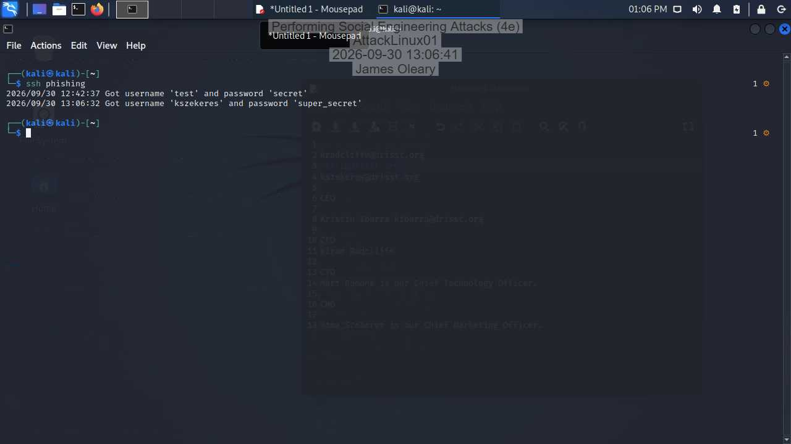
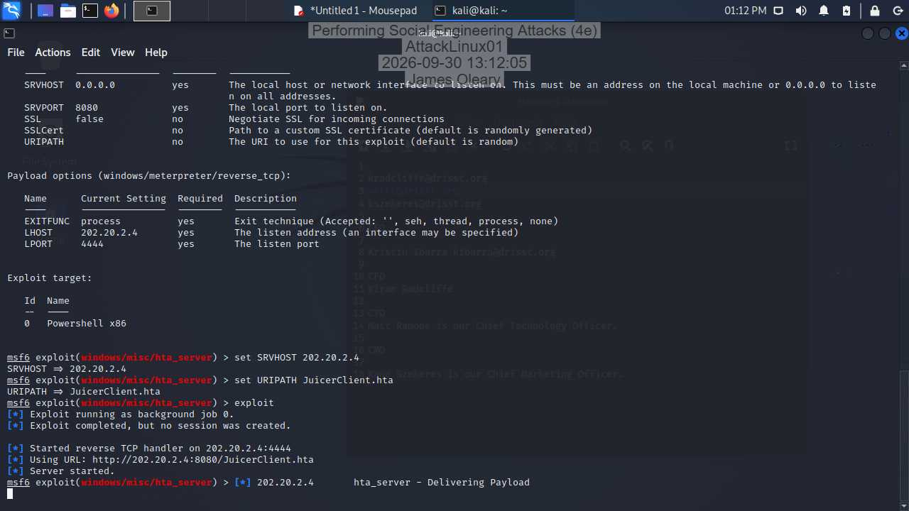
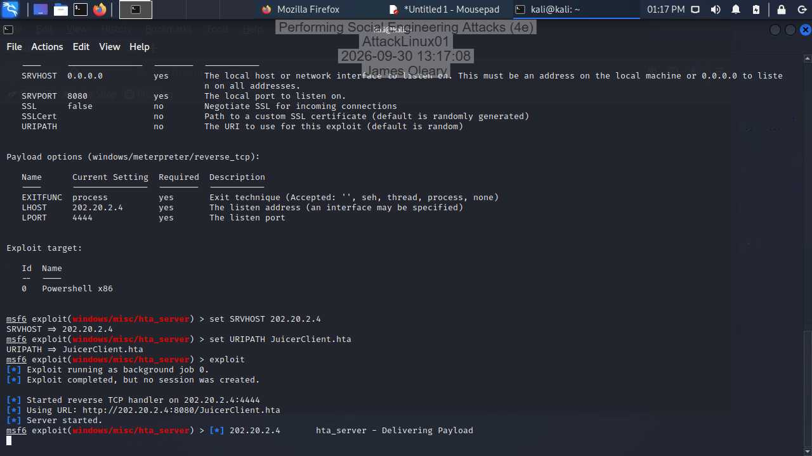
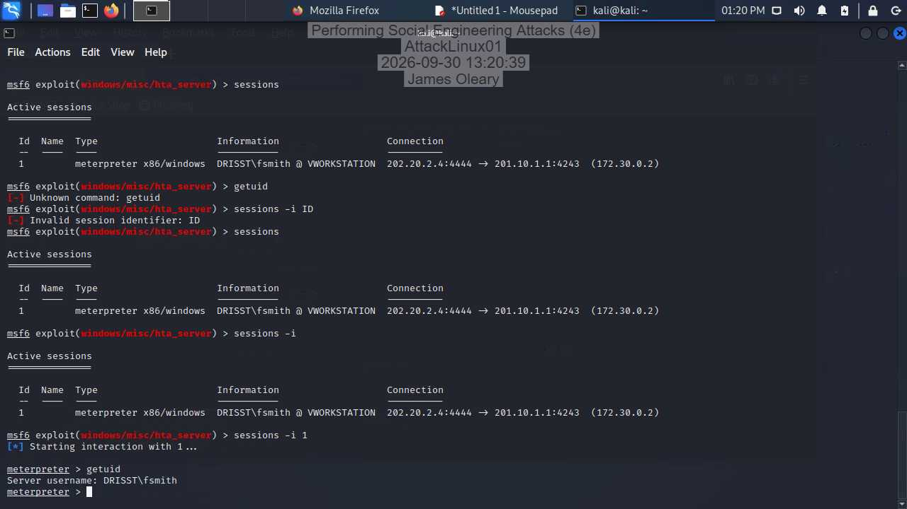
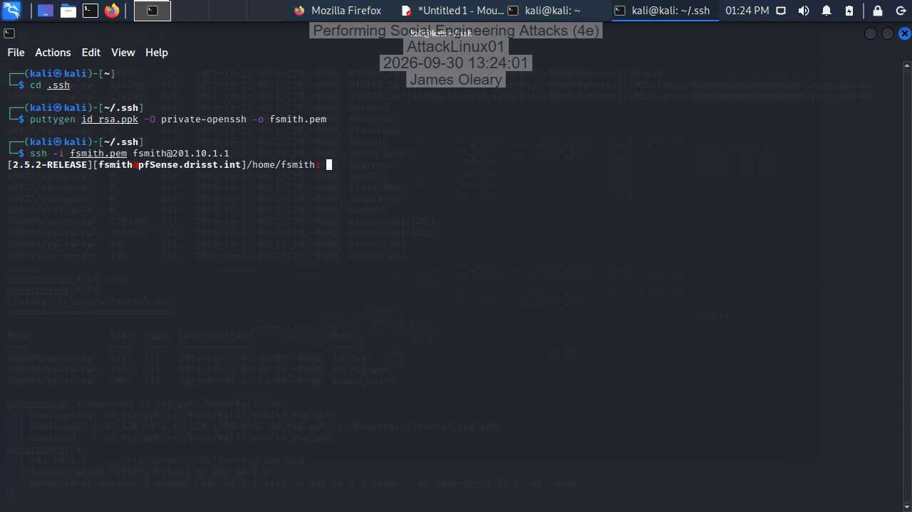

# Performing Social Engineering Attacks: Lab Write-Up

**Course:** IST 476/704 Applied Information Security · Syracuse University iSchool
**Lab platform:** Jones & Bartlett *Ethical Hacking, 4e* (Lab 08), instructor-provided cloud lab
**Author:** James O'Leary

> **Authorized classroom simulation.** Everything here was performed inside an isolated,
> instructor-provided cloud lab against synthetic targets: a fictional company
> (`drisst.org`), the deliberately vulnerable OWASP Juice Shop, and scripted "victim"
> personas. No real person, mailbox, domain, or system was touched, and every name, address,
> and credential shown is lab-generated test data. The point of the exercise, and of this
> write-up, is the defensive lesson.

---

## Overview

The scenario: a penetration-testing team is hired by DRISST, which has just finished a
security-awareness training cycle, to test whether that training holds up against a
targeted **spear-phishing** attack. The goal is credential capture. I built the pretext
entirely from DRISST's own public website, sent a spoofed executive email, and confirmed a
capture. From there I extended the engagement into a **watering-hole** attack against a site
DRISST employees frequent, and used the resulting foothold to reach the organization's
firewall.

The engagement breaks into three phases:

| Phase | What it demonstrates |
|---|---|
| Hands-On Demonstration | Reconnaissance → spear-phishing → credential capture |
| Applied Learning | Watering-hole payload → stored XSS → Meterpreter → post-exploitation |
| Challenge & Analysis | Defensive recommendations (email authentication, browser hardening) |

---

## Environment

| System | Platform / Address | Role |
|---|---|---|
| **AttackLinux01** | Kali Linux · `202.20.2.4` | Attacker workstation (SET, Metasploit, SSH) |
| **WebServer02** | Ubuntu · `203.30.3.40` | Hosts `drisst.org` (recon target) |
| **WebServer01** | Ubuntu · `202.0.0.86` | Hosts OWASP Juice Shop (watering hole) |
| **VictimWindows** | Windows Server 2022 · `172.30.0.2` | Simulated employee workstation |
| **pfSense** | `201.10.1.1` (WAN) | DRISST firewall |
| **RouterBGP** | Debian Linux | Edge routing |

**Tools:** Firefox, `setoolkit` (SET), `msfconsole` (Metasploit), OpenSSH, PuTTYgen.

---

## Phase 1: Hands-On Demonstration

### Part 1: Reconnaissance

Spear-phishing depends on trust, and that trust usually comes from information the target has
already made public. DRISST's homepage is thin, but its **About Us** page over-shares: it
lists the full C-suite along with each executive's direct email address. That one page is
enough to choose a believable sender and recipient without any technical intrusion.

**Harvested from the DRISST About Us page:**

| Name | Role | Email |
|---|---|---|
| Kristin Ibarra | CEO | kibarra@drisst.org |
| Kiran Radcliffe | CFO | kradcliffe@drisst.org |
| Matt Ramone | CTO | mattr@drisst.org |
| Kane Szekeres | CMO | kszekeres@drisst.org |

The **New Products** page then supplied a plausible and entirely routine pretext: it's
reasonable for a CTO to ask a CMO to promote a new product on social media, and social
"Share" links give a natural place to hide a malicious URL. Before sending anything, I
tested the team's phishing landing page with throwaway credentials (`test` / `secret`) to
confirm the capture-to-log pipeline worked end to end.

*The phishing log records the test submission (`test` / `secret`), which confirms that credentials entered on the landing page are written to `/home/user/phishing.log`.*

### Part 2: Spear-phishing email

Using SET's mass-mailer against a single recipient, I spoofed the **From** header as the
CTO (`mattr@drisst.org`, display name *Matt Ramone*) and sent an HTML message to the CMO
(`kszekeres@drisst.org`). HTML matters here: it lets the payload render as clean, clickable
text rather than a raw URL. The message closes with a "Share" link pointing at a look-alike
domain. The lab swaps the Latin **c** in `social.com` for a **Cyrillic с (U+0441)**, an
IDN/Punycode homograph that is almost indistinguishable in the address bar.

**Pretext message sent to Kane:**

> A message to Kane. With our new product coming out soon we need to start ramping up our
> promotion. *(closing with the homograph "Share" link)*

The pretext leans primarily on Cialdini's **authority** principle (the message appears to
come from the CTO) plus a routine, expected request the CMO would act on without a second
thought.

*SET reports the spoofed message was delivered to `kszekeres@drisst.org` through the open relay.*

A lab script then plays the victim: within a couple of minutes it reads the mailbox,
follows the link, and submits credentials, which land in the phishing log.

*The log now shows the simulated victim's submission (`kszekeres` / `super_secret`), captured at 13:06:32.*

---

## Phase 2: Applied Learning (Watering-Hole Attack)

With the phishing objective met, the engagement pivoted to a watering-hole chain against a
juice-shop site known to be visited by DRISST staff.

### Part 1: Prepare the payload

Using Metasploit's `exploit/windows/misc/hta_server`, I stood up a malicious **HTA**
(HTML Application) payload on the attacker host (`SRVHOST 202.20.2.4`,
`URIPATH JuicerClient.hta`). HTA runs outside the browser's security sandbox as a fully
trusted Windows application, so it executes with whatever permissions the user who opens it
holds. I configured the module with a `reverse_tcp` payload and left it running in the
background, ready to serve the file and catch the callback.

*The `hta_server` module is running and the reverse TCP handler is live on `202.20.2.4:4444`, serving `JuicerClient.hta`.*

### Part 2: Stored XSS on the Juice Shop

OWASP Juice Shop's customer-feedback form is vulnerable to **stored XSS**. I submitted a
feedback comment containing an injected `iframe` pointing at the HTA payload. Because the
payload is stored server-side, every later visitor to that page is served the malicious
content without any per-victim interaction. A lab script simulates an employee visiting the
page, and the payload fires back a Meterpreter session to AttackLinux01.

*A Meterpreter session opens back to the attacker: `DRISST\fsmith @ VWORKSTATION`, `202.20.2.4:4444 → 201.10.1.1`.*

### Part 3: Post-exploitation and lateral movement

From the Meterpreter session I confirmed the compromised identity, then looked for reusable
secrets. That's a standard post-exploitation step, since SSH keys are a fast path to other
machines.

*`getuid` returns `Server username: DRISST\fsmith`, confirming code execution as the victim user.*

Browsing the user's home directory surfaced an `.ssh` folder containing `id_rsa.ppk` (a
PuTTY-format private key). I downloaded it, converted it to OpenSSH format with
`puttygen ... -O private-openssh`, and used it to authenticate to the DRISST firewall. A
single careless feedback form had led to a shell on network infrastructure.

*Key-based SSH login succeeds to the pfSense firewall: `[2.5.2-RELEASE][fsmith@pfSense.drisst.int]`.*

---

## Findings & MITRE ATT&CK Mapping

The main finding: DRISST's own public content, an About Us page listing executives with
direct emails plus a promotable product page, was enough to build a credible, targeted
pretext with no technical intrusion up front. The awareness training did not stop the
simulated user from submitting credentials to a homograph look-alike domain. A second,
independent path (stored XSS on a third-party site) led all the way to a shell on the
firewall.

| Stage observed | MITRE ATT&CK |
|---|---|
| Harvesting names/roles/emails from About Us | **T1589** Gather Victim Identity Information |
| Using the site to source a pretext | **T1598** Phishing for Information |
| Spoofed-sender email with a malicious link | **T1566.002** Phishing: Spearphishing Link |
| CTO impersonation | **T1656** Impersonation |
| IDN/Punycode homograph domain | Masquerading via look-alike domain |
| Stored XSS delivering a payload | **T1189** Drive-by Compromise / **T1059** Command execution |
| Reusing a stolen SSH private key | **T1552.004** Unsecured Credentials: Private Keys |
| Key-based login to the firewall | **T1021.004** Remote Services: SSH |

---

## Phase 3: Challenge & Analysis (Defensive Recommendations)

### Stopping spoofed email: SPF, DKIM, and DMARC

The core weakness exercised in Phase 1 was that mail forged as `@drisst.org` was accepted
even though it came from an unauthorized relay. Three complementary DNS-based controls close
that gap.

**SPF (Sender Policy Framework)** checks whether a sending server's IP is authorized to
send for a domain. DRISST publishes a DNS TXT record listing the hosts allowed to send as
`drisst.org`, and the receiver compares the connecting IP against that list. An example
record is `drisst.org. IN TXT "v=spf1 ip4:203.0.113.25 mx -all"`. Its limitation is that SPF only
authenticates the envelope sender, not the visible `From:` header, and an attacker who owns
a domain can publish a passing SPF record for it.

**DKIM (DomainKeys Identified Mail)** cryptographically signs outgoing mail so tampering is
detectable. DRISST's server signs each message with a private key; the receiver verifies it
against a public key in DNS. The flow: the server hashes selected headers and the body,
signs that hash, and adds a `DKIM-Signature` header exposing the signing domain (`d=`) and
selector (`s=`); the receiver reads `d=`/`s=`, fetches the public key, and verifies. DKIM
gives stronger integrity than SPF and survives forwarding. Its limitation: a valid signature
only proves the `d=` domain signed the message, so an attacker can still sign with their own
domain's key.

**DMARC (Domain-based Message Authentication, Reporting & Conformance)** ties SPF and DKIM
to the visible `From:` domain and tells receivers what to do on failure (`none`,
`quarantine`, `reject`), while sending the domain owner aggregate reports. DMARC passes when
**SPF *or* DKIM passes and the authenticated domain aligns with the `From:` domain.** That
alignment check is what blocks the spoofed-CTO email used in this lab.

**Recommendation:** deploy all three. They're complementary: SPF authorizes senders, DKIM
protects integrity, and DMARC enforces alignment and reporting on top of both. Implementing
only one leaves gaps the others would catch; together, with a DMARC policy of `p=reject`,
they would have rejected the spoofed message outright.

### Hardening the browser against homograph domains

The phishing link relied on a Cyrillic `с` inside `social.com`, which Firefox renders in
Unicode by default and is therefore nearly impossible to spot. Forcing Firefox to display
the underlying **Punycode** removes the disguise. The spoofed domain then shows as an `xn--`
ASCII string instead of text dressed up to look like the real site.

1. Open a new tab, type `about:config`, and press Enter.
2. Accept the warning to reach the advanced settings.
3. Search for `network.IDN_show_punycode`.
4. It's `false` by default. Double-click it to set it to `true`.
5. The change takes effect immediately, with no restart.

To confirm it's working, visit a known IDN: a domain like `www.äänestyspaikat.fi` should
now read as `www.xn--nestyspaikat-fcba.fi`. The trade-off is that the setting applies to
every IDN, so legitimate non-Latin domains also show as `xn--` strings; for a
security-conscious environment that's a fair price, and it can be pushed org-wide through
enterprise policy.

---

## Analysis: Why public employee information raises spear-phishing risk

Publicly available employee information is the ammunition for a spear-phishing attack,
because it lets an attacker impersonate someone the target trusts and frame a request the
target already expects. Ball et al. (2012) showed that details taken straight from a company
website, such as names, titles, and email addresses, are enough to build convincing phishing
messages aimed at individual employees. This lab was a direct example. The DRISST "About Us"
page listed the company's C-level executives alongside their direct email addresses, which
handed me a believable sender and recipient pair (CTO Matt Ramone emailing CMO Kane Szekeres)
with no technical intrusion at all. Reporting relationships make a request plausible,
published email addresses reveal the organization's address format, and a current project
such as the "New Products" page supplies a timely reason to act and a natural place to hide a
link. The risk is measurable. Jagatic et al. (2007) found that phishing enriched with public
social context succeeded against roughly 72% of targets, compared with about 16% for
context-free controls, and the Verizon (2025) DBIR still places the human element at the
center of most breaches. DRISST can reduce this exposure without silencing legitimate
communication: publish role-based aliases instead of executives' direct addresses, limit
"About Us" detail to what operations actually require, and back that openness with email
authentication, MFA, and an easy way to report suspicious mail.

---

## References

Ball, L., Ewan, G., & Coull, N. (2012). *Undermining social engineering using open source intelligence gathering.* In Proceedings of the International Conference on Knowledge Discovery and Information Retrieval (KDIR) (pp. 275–280). SciTePress.

Jagatic, T. N., Johnson, N. A., Jakobsson, M., & Menczer, F. (2007). Social phishing. *Communications of the ACM, 50*(10), 94–100. https://doi.org/10.1145/1290958.1290968

Verizon. (2025). *2025 data breach investigations report.* Verizon Business. https://www.verizon.com/business/resources/reports/dbir/

---

Educational lab write-up. Conducted in an isolated, authorized training environment against synthetic targets. Do not apply these techniques against systems you do not own or have explicit written permission to test.
